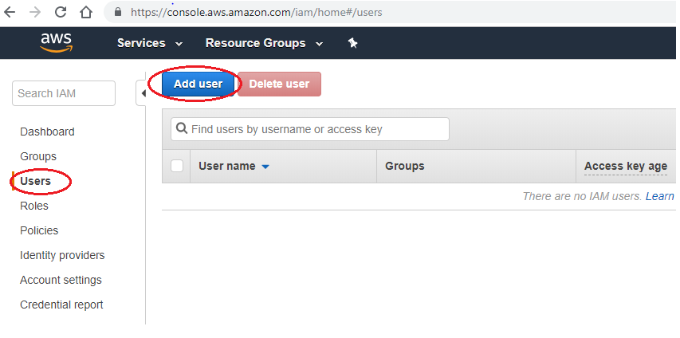
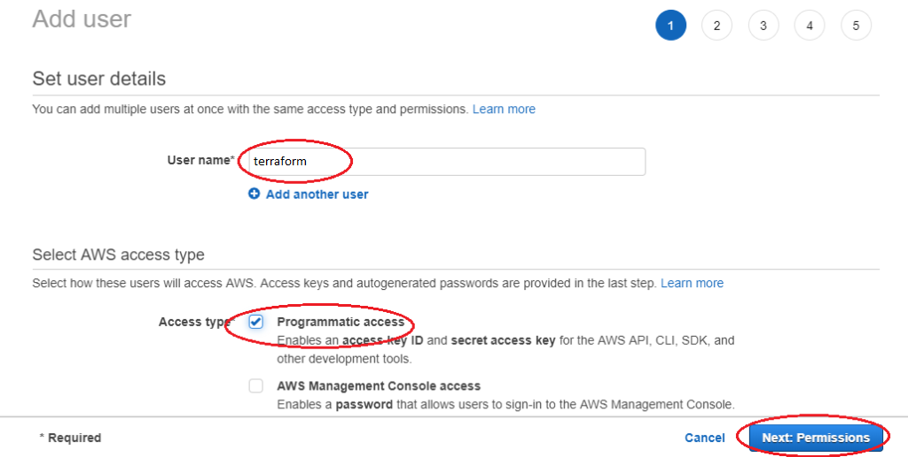
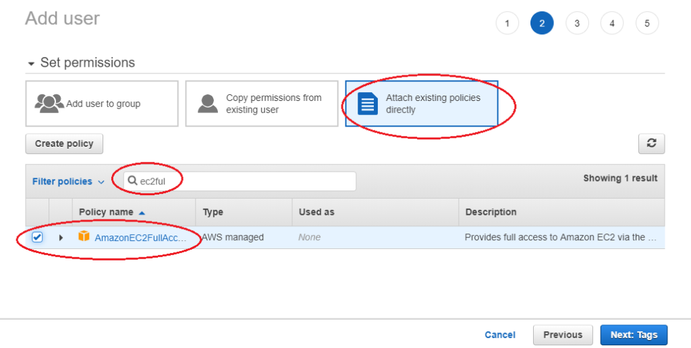
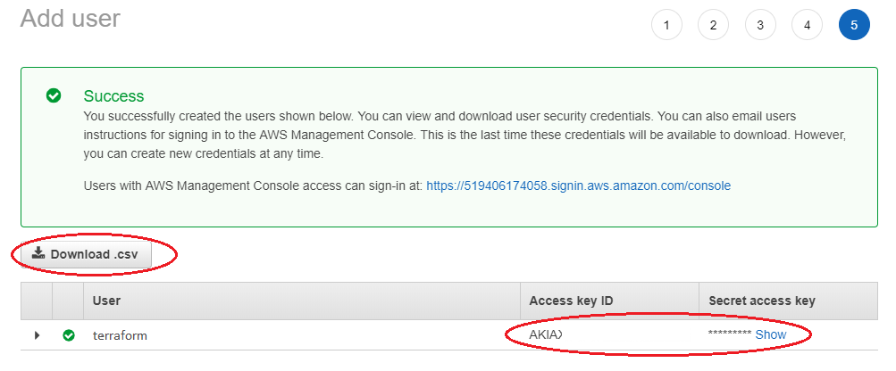

# AWS-TERRAFORM-TUTORIAL 1
In this tutorial we are going to use the version 0.12.7 of Terraform. We are going to create a very very simple [ec2](https://aws.amazon.com/en/ec2/) instance in AWS using nothing but [Terraform](https://www.terraform.io/). I will try to stay very informative, very direct, straight to the point. This means that in this tutorials we are not going to cover every single feature provided by Terraform. Later on other tutorials will be written to cover more advanced features such as different types of resources, modules, as well as how to origanize your code, etc... So don't panic there will be more to learn on Terraform in the future. For now, here are the topic that we are going to cover in this tutorial :
- [AWS Admin IAM User setup and Access Tokens](#AWS-Admin-IAM-User-setup-and-Access-Tokens)
- [AWS Provider, State and Validation](#AWS-Provider,-State-and-Validation)
- [AWS VPC Resource and Terraform apply](#AWS-VPC-Resource-and-Terraform-apply)
- [AWS IGW (Internet Gateway) and Subnets](#AWS-IGW-(Internet-Gateway)-and-Subnets)
- [AWS Route table, NACL and Security Groups](#AWS-Route-table,-NACL-and-Security-Groups)
- [Elastic IP, SSH KEY and Dynamic AMI](#Elastic-IP,-SSH-KEY-and-Dynamic-AMI)
- [AWS EC2 Instance](#AWS-EC2-Instance)
- [Terraform destroy](#Terraform-destroy)

## AWS Admin IAM User setup and Access Tokens
Before Terraform can interact with AWS, we need to create a dedicated user within AWS that that has Programatic access and give this user administrative permission. Finaly we will have to grab the access tokens.
Here are the steps :
- Sign in to the AWS Management Console and open the IAM console at https://console.aws.amazon.com/iam/.
- In the navigation pane, choose **Users** and then choose **Add user**.
- Type the user name for the new user. This is the sign-in name for AWS.
- Select the type of access this set of users will have.
Select **Programmatic access**. This creates an access key for each new user. You can view or download the access keys when you get to the Final page.
- Choose **Next: Permissions**
- On the **Set permissions** page, specify how you want to assign permissions to this set of new users. choose **Attach Existing Policies Directly** and in the Policy Filter type **AmazonEC2FullAccess**, you can choose any permission level, but in this example, I’ll click on the checkbox next to **AmazonEC2FullAccess**
- Choose **Next: Tags –> Next: Review** to see all of the choices you made up to this point. When you are ready to proceed, choose **Create user**.
- To view the users’ access keys (access key IDs and secret access keys), choose **Show** next to each password and access key that you want to see. To save the access keys, choose **Download .csv** and then save the file to a safe location. **You will not have access to the secret keys again after this step**.


## AWS Provider, State and Validation
In this part we are going to set up a AWS Provider as well as the Terraform State initialisation and finaly how we can perform code validation in Terraform. Before we can do anything we have to create a brand new directory and in it create a file named main.tf (the name does not realy matter).

In this file, the first thing we need to do is tell Terraform that we want to use the [AWS Provider](https://www.terraform.io/docs/providers/aws/index.html). Now, for the AWS Provider to work properly it has to know the aws region that you wan to deploy on and also the authentification information.

```hcl
provider "aws"{
  profile = "default"
  region  = "eu-west-3"
}
```

## AWS VPC Resource and Terraform apply


## AWS IGW (Internet Gateway) and Subnets


## AWS Route table, NACL and Security Groups


## Elastic IP, SSH KEY and Dynamic AMI


## AWS EC2 Instance


## Terraform destroy